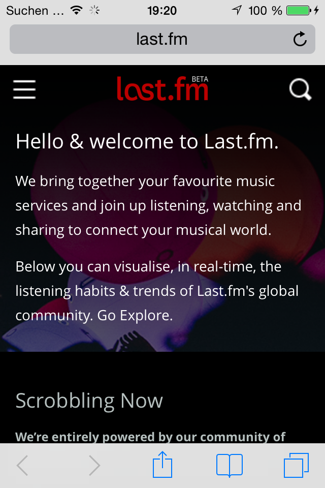

# lo<3dRecords

A simple iOS app for querying [last.fm](http://www.last.fm/) for an artist's most listened-to album.

## Setup

To use the app, you have to have a valid **last.fm API key**. You can apply for one such key on [last.fm's API page](http://www.last.fm/api).

Once you have your last.fm API key, find the ```config``` directory, rename the file ```lovedrecords.xcconfig.template``` contained within to ```lovedrecords.xcconfig``` and add your API key to it.

You can then run the app from within Xcode using either Xcode's Simulator or an actual iPhone connected to your computer.

## Screenshots

  


  


  
